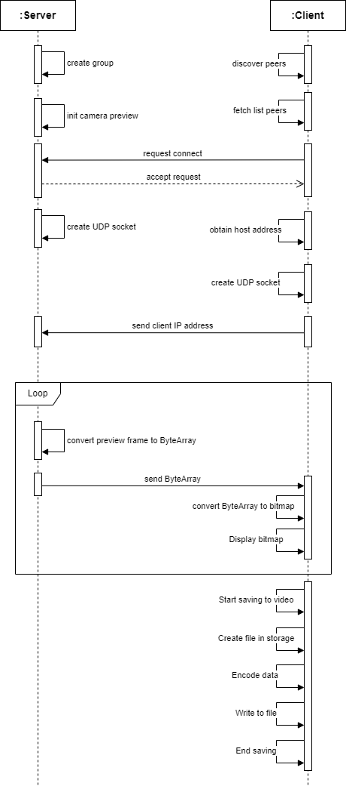
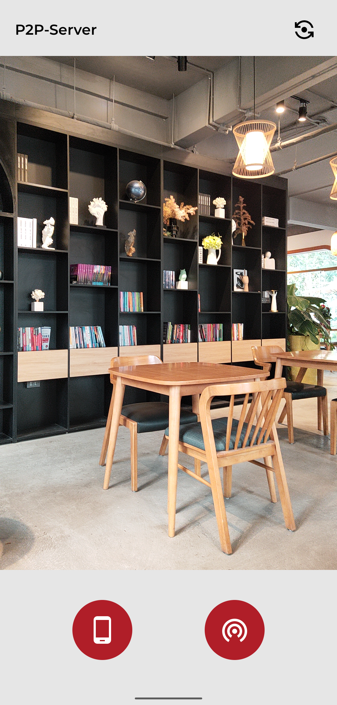
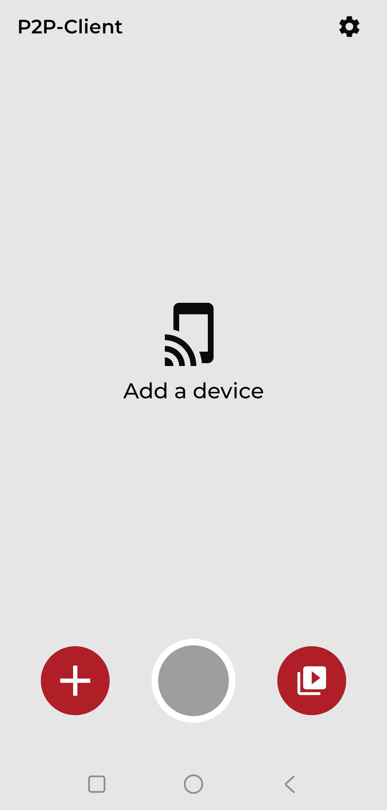
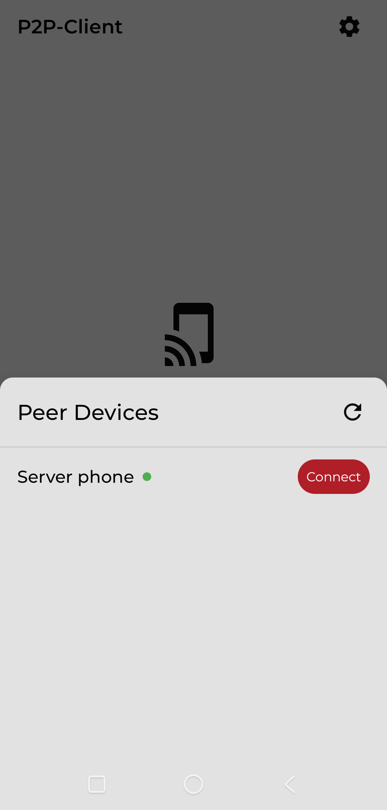
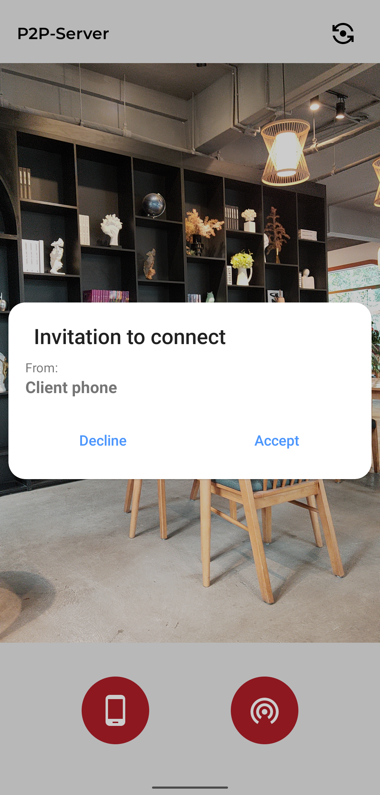
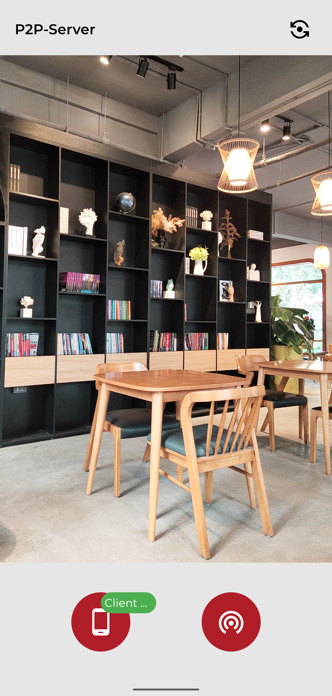
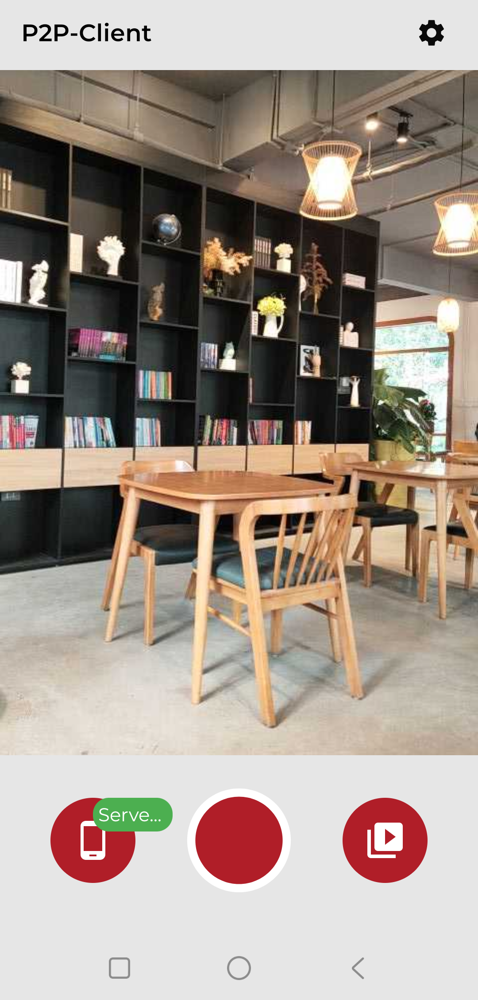
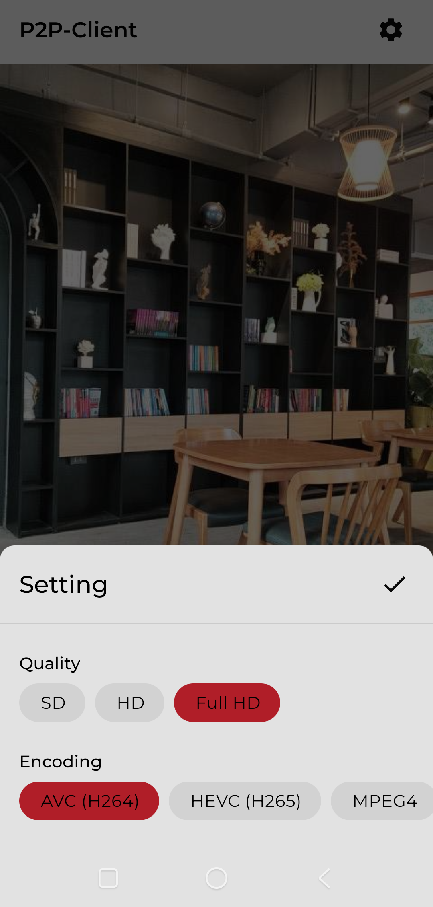
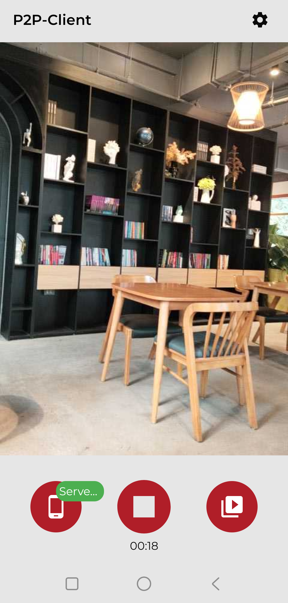

# wifi-p2p-streaming

## About the Project 💡

This project demonstrates how to connect and share camera streaming between Android devices using Wifi-direct and socket. 

This wraps all framework's Wifi-direct and CameraX APIs and packs into Android library modules for fast and convenient use.

🚀**Technical specification**:
* Provides separate APKs for both server and client sides.
* Support peer-to-peer connection via `Wifi-direct`.
* Data transmission via `Datagram socket (UDP)`.
* Build with `CameraX` APIs.
* Support video recording on client side with `AVC(H264)` encoder.
* Improve performance.

🛣️**Upcoming road map**:
* Add support for other protocols: `Streaming socket (TCP)`, `RTSP (Real Time Streaming Protocol)`.
* Add streaming quality selections: `SD`, `HD`, `Full HD`.
* Add support for other encoders: `HEVC(H265)`, `MPEG4`.

## Built on 🛠
🏭 **[android-core-architecture-lite](https://github.com/anhhn2312/android-core-architecture-lite)**:
A complete code base that helps to fast build a small app (demo, test) in a modern and high performance way.

## Sequence diagram ✏️

## Screenshots 🖼️
**Main UI**

 

**Discover peers and request connection**

 

**Connection established and streaming**

 

**Client side settings**

**Client recording**

